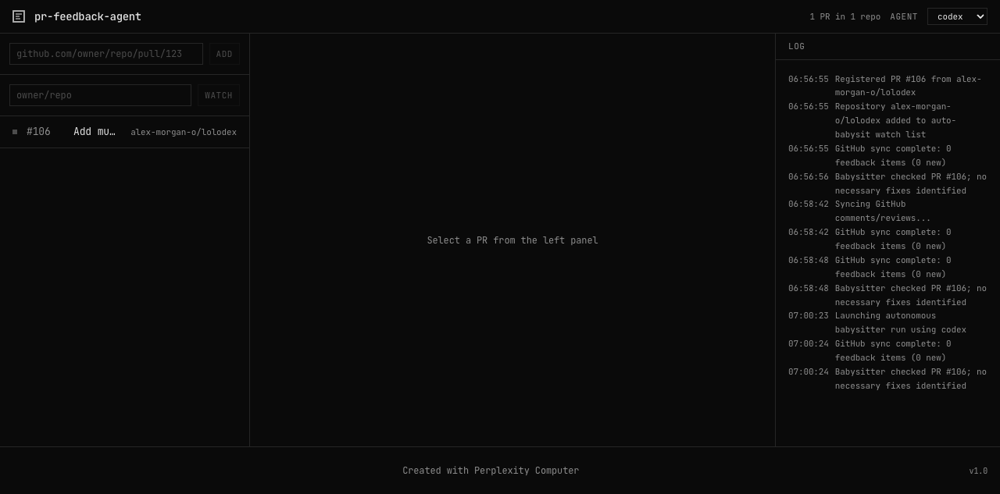
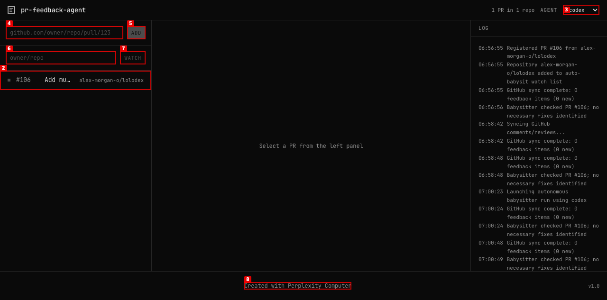
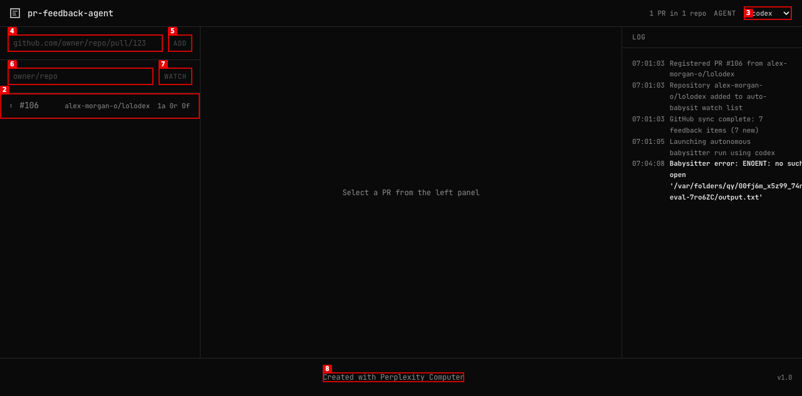
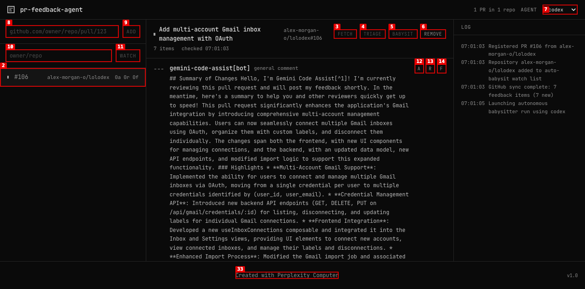

# Dogfood Report: localhost:5001

| Field | Value |
|-------|-------|
| **Date** | 2026-03-15 |
| **App URL** | http://localhost:5001 |
| **Session** | localhost-5001 |
| **Scope** | Full app |

## Summary

| Severity | Count |
|----------|-------|
| Critical | 1 |
| High | 0 |
| Medium | 2 |
| Low | 2 |
| **Total** | **5** |

## Issues

### ISSUE-001: Invalid PR URL accepted silently with no error feedback

| Field | Value |
|-------|-------|
| **Severity** | medium |
| **Category** | ux / functional |
| **URL** | http://localhost:5001/#/ |
| **Repro Video** | videos/issue-001-invalid-url.webm |

**Description**

The ADD button becomes enabled as soon as any text is typed in the PR URL input field, regardless of whether the text is a valid GitHub PR URL. When an invalid URL (e.g. `not-a-pr-url`) is submitted, the app fails silently: no error message is shown, the input is cleared, and the PR selection is deselected. The user has no idea what went wrong.

**Expected:** Either (a) keep ADD disabled until the input matches a valid PR URL pattern, or (b) show an inline error after clicking ADD with an invalid URL.

**Repro Steps**

1. Open the app at http://localhost:5001
   

2. Type `not-a-pr-url` in the PR URL input field — ADD button becomes enabled despite invalid format

3. Click ADD

4. **Observe:** No error message is shown. The input clears and the PR detail panel collapses. The user receives zero feedback.
   

---

### ISSUE-002: FETCH/TRIAGE/BABYSIT buttons intermittently disable with no loading indicator

| Field | Value |
|-------|-------|
| **Severity** | medium |
| **Category** | ux |
| **URL** | http://localhost:5001/#/ |
| **Repro Video** | N/A |

**Description**

The FETCH, TRIAGE, and BABYSIT action buttons go disabled roughly every 60–90 seconds while the babysitter's background poll cycle runs. There is no loading spinner, no tooltip, no disabled state explanation — the buttons simply stop being clickable. If a user tries to click TRIAGE during a poll cycle, they get no interaction and no feedback. This creates a confusing "buttons that don't work" experience with no explanation of why or when they'll be available.

**Expected:** Either (a) show a subtle loading indicator during poll cycles, or (b) add a tooltip on disabled state like "Babysitter running — available shortly".

**Repro Steps**

1. Open the app and select a PR that has fetched feedback items

2. Observe that FETCH, TRIAGE, and BABYSIT buttons alternate between enabled and disabled unpredictably

3. Try to click TRIAGE during a disabled window — no interaction, no error, no feedback
   

---

### ISSUE-003: A/R/F per-item buttons have no accessible labels linking them to their items

| Field | Value |
|-------|-------|
| **Severity** | low |
| **Category** | accessibility |
| **URL** | http://localhost:5001/#/ |
| **Repro Video** | N/A |

**Description**

Each feedback item has three action buttons labeled "A", "R", "F" (Accept, Reject, Flag). With 7 feedback items loaded, the accessibility tree exposes 21 identical buttons: 7× "A", 7× "R", 7× "F" — none of which indicate which feedback item they belong to. A keyboard or screen reader user cannot determine what each button acts on. The short abbreviations "A", "R", "F" also have no `aria-label`, `title`, or visible expansion anywhere in the UI.

**Expected:** Buttons should have accessible names like `aria-label="Accept: [reviewer name] - [comment excerpt]"` or at minimum a visible tooltip on hover.

**Repro Steps**

1. Select a PR with feedback items loaded

2. **Observe:** The accessibility tree contains 7× button "A", 7× button "R", 7× button "F" with no context about which item each button belongs to
   

---

### ISSUE-004: Major app content not in accessibility tree (feedback items, LOG, status text)

| Field | Value |
|-------|-------|
| **Severity** | low |
| **Category** | accessibility |
| **URL** | http://localhost:5001/#/ |
| **Repro Video** | N/A |

**Description**

The main content areas of the app — the feedback item text (markdown, reviewer names, code comments), the LOG section with timestamps, and the "No feedback yet. Fetch or wait for the babysitter poll cycle." empty state message — are all absent from the accessibility tree. They are rendered in the DOM and visible to sighted users but not exposed as accessible text. Screen readers would skip all of this content entirely.

**Expected:** Feedback items should use semantic `<article>` or ARIA roles with accessible text for reviewer identity, comment type, and body content. The LOG region and empty state text should be exposed as accessible live regions.

**Repro Steps**

1. Select a PR with feedback loaded

2. Take an accessibility snapshot — no feedback item body text, reviewer info, or LOG entries appear

3. **Observe:** The snapshot only shows the A/R/F buttons, none of the surrounding content
   

---

### ISSUE-005: Server crash / connection refused after REMOVE interaction

| Field | Value |
|-------|-------|
| **Severity** | critical |
| **Category** | functional |
| **URL** | http://localhost:5001/#/ |
| **Repro Video** | videos/issue-003-remove.webm |

**Description**

After attempting to trigger the REMOVE button (which removes a PR from the tracked list), the server at localhost:5001 became unreachable (`ERR_CONNECTION_REFUSED`). All subsequent navigation attempts failed. The app was completely unavailable for the remainder of the session.

**Note:** The REMOVE button was intermittently disabled during the babysitter poll cycle, making it impossible to click via the normal mechanism. A JavaScript fallback was used to click it, which may have contributed to the issue. Root cause (server crash vs. external stop) cannot be determined without server logs — but the timing and consequence are worth flagging.

**Expected:** REMOVE should gracefully remove the PR and leave the app running in a clean empty state, not cause the server to go down.

**Repro Steps**

1. Add a PR and allow the babysitter to fetch feedback items

2. Select the PR and attempt to click REMOVE

3. **Observe:** Server becomes unreachable — `ERR_CONNECTION_REFUSED` on all subsequent requests
   

---
